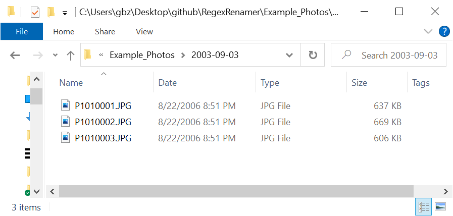
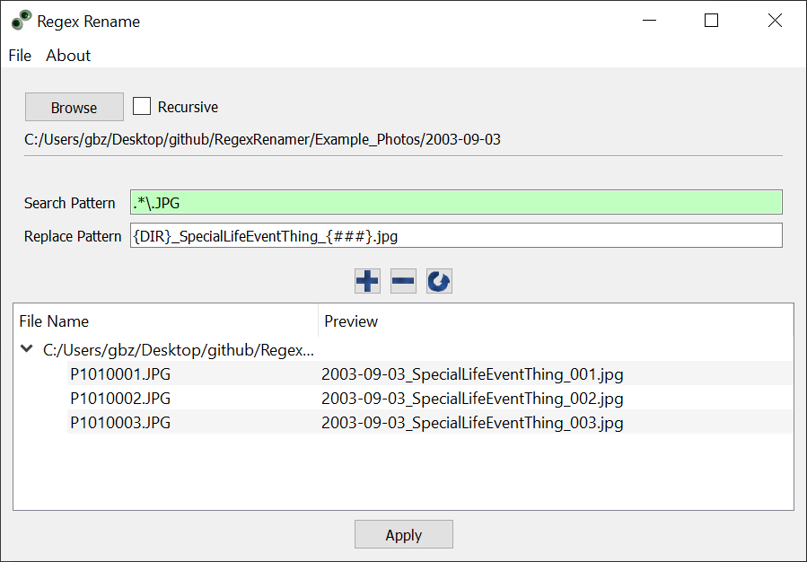
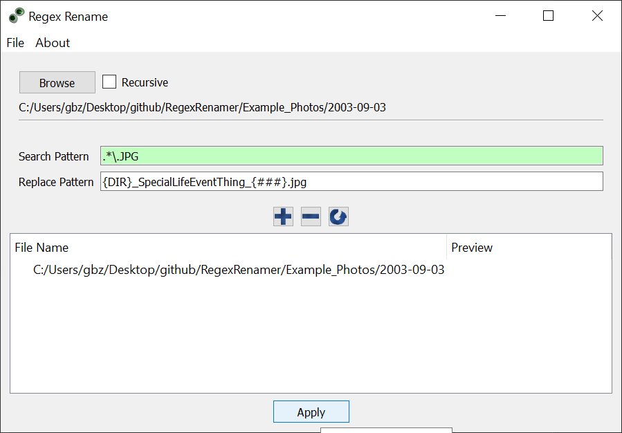
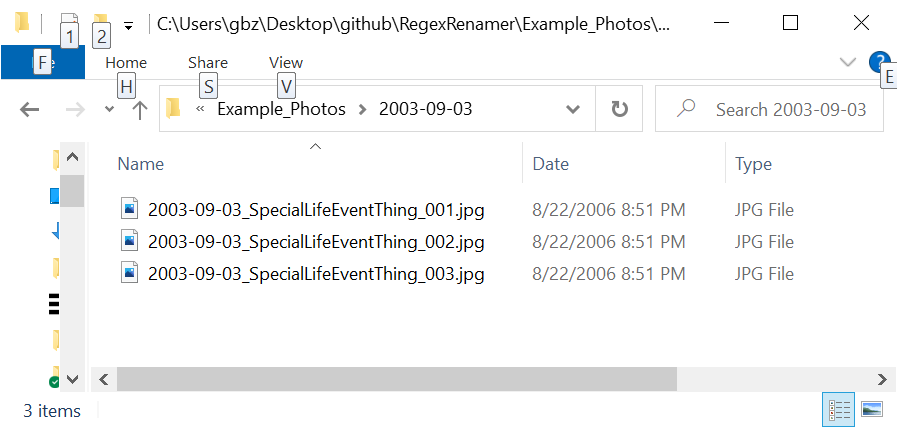
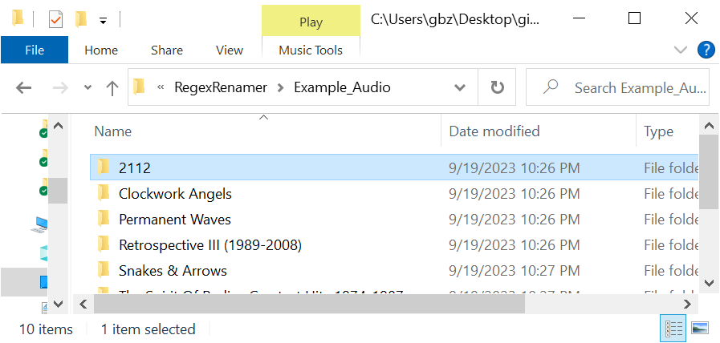
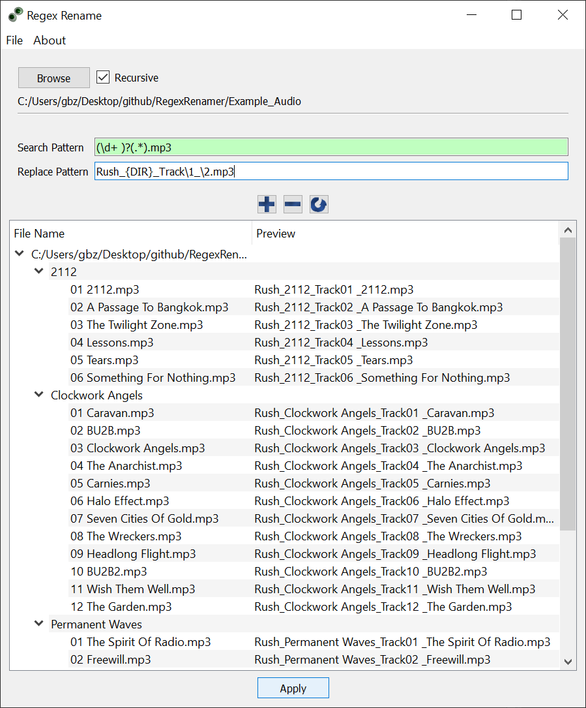
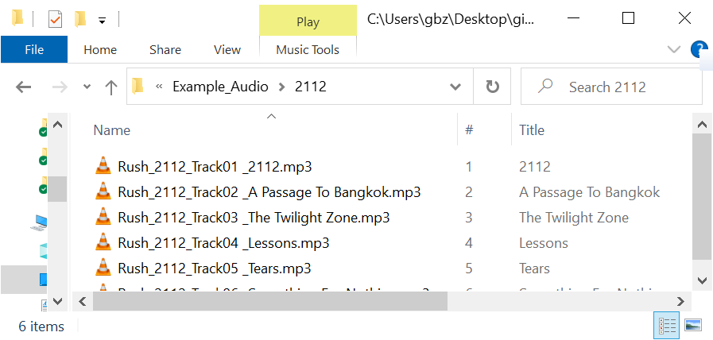

# RegexRename

Developed with C++ and Qt with about 500 lines of code.

Sometimes you have a lot of files that need to be renamed, like when you download photos from your camera or need to clean up your music library. This is a no-nonsense tool that uses the power of Regular Expressions (Regex) to make this easy. To start using, you should know how to use Regular Expressions. [Basic Concepts](https://en.wikipedia.org/wiki/Regular_expression#Basic_concepts) and [Syntax](https://en.wikipedia.org/wiki/Regular_expression#Syntax) are good places to start.

## Example #1: Photos
I was looking through some old hard drives and found folders full of old photos. For the screenshots I limited the example to a few files, but it easily handled the actual directories.

I navigated to the folder and crafted a Regular Expression in the **Search Pattern** field to match any file that was a jpg. In the **Replace Pattern** I used **_{DIR}_** to use the containing folder name, a useful label to remind myself what special life event these photos are from, and a number using **_{###}_** to keep things in order. If there were less than 100 files to rename, I might have only used **_{##}_**, as two digits would have been enough to stay aligned.

I created both these patterns interactively and could always see what files were matched by the **Search Pattern** and what the results of the rename would be when the **Replace Pattern** is applied.

Once I was happy with everything, I clicked the **Apply** button. All the files disappeared from the application UI, because the new file names didn't match the **Search Pattern**.

I verified that the files were renamed correctly in the Windows Explorer.

## Example #2: Music

I was archiving some old Rush CDs. Instead of fighting the archival software, I just used RegexRename to do the heavy lifting.

I navigated to where all the Rush albums were stored and checked **Recursive**. Time for some Regex: I used capture groups to move some text pieces into the final file name. The preview shows that each track will have the Artist, Album, Track Number, and Title.

Applying the changes updates all the files in all the folders in one fell swoop.

